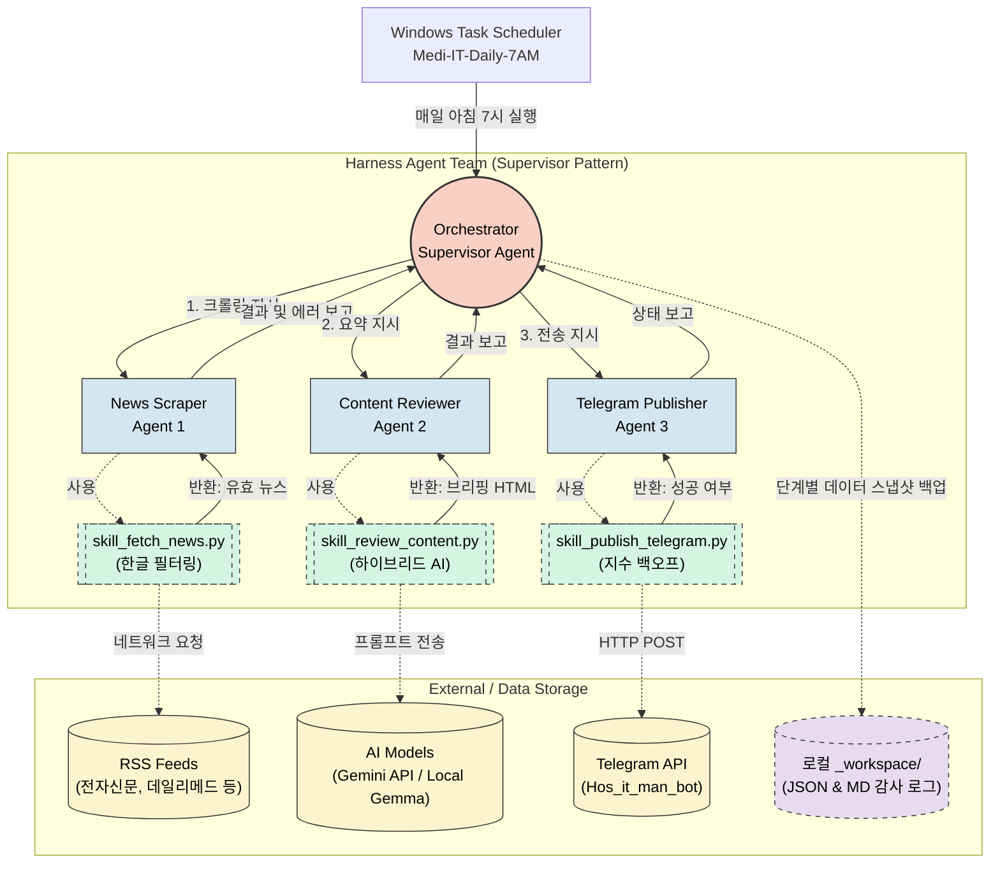

# Medi-IT 브리핑 하네스 아키텍처 구성도

새롭게 구축된 **Medi-IT 뉴스 브리핑 하네스**의 전체 시스템 구성도입니다. 윈도우 스케줄러를 기점으로, 중앙의 오케스트레이터가 3명의 전문가 에이전트를 감독하며 파이프라인을 제어하는 **감독자(Supervisor) 패턴**을 띄고 있습니다.

### 아키텍처 핵심 포인트
1. **단일 진입점 통제**: 윈도우 스케줄러는 오직 `orchestrator.py` 하나만 호출하며, 내부 복잡성은 오케스트레이터가 모두 캡슐화하여 관리합니다.
2. **책임 분리 원칙**: 스크래핑 로직에 에러가 나면 `skill_fetch_news.py`만 수정하면 되고, 전송 에러가 나면 `skill_publish_telegram.py`만 수정하면 되는 완벽한 모듈화 구조입니다.
3. **결함 허용(Fault Tolerance)**: 특정 에이전트 작업 중 치명적인 에러(예: 수집 결과 0건)가 발생하면, 오케스트레이터가 즉시 상황을 인지하고 후속 작업을 차단하여 불량한 결과물이 전송되는 것을 미연에 방지합니다.
