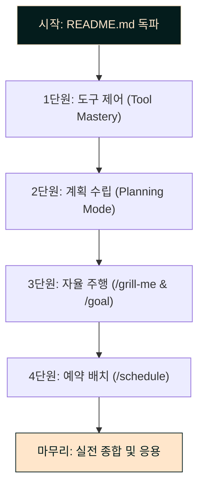

# 🌌 Antigravity Mastery (Pn7)
> AI 협업 에이전트 '안티그래비티'를 가장 효율적으로 다루기 위한 학습 가이드 및 실습 패키지입니다.

이 과정은 안티그래비티의 고유한 협업 메커니즘과 강력한 도구 제어 능력을 익혀, 사장님의 업무 자동화 파이프라인 구축 및 유지보수를 10배 이상 효율적으로 리드할 수 있도록 돕습니다.

---

## 🧭 학습 로드맵

안티그래비티 마스터리는 총 4개의 단원과 각 단원별 실습 미션으로 구성되어 있습니다.

### 📘 단원별 학습 내용

1. **[1단원: 도구 제어 (Tool Mastery)](file:///c:/Users/ismadmin/Documents/Workspace/Pn7_Mastery/chapters/chapter1_tools/README.md)**
   * **목표:** 안티그래비티가 백그라운드에서 사용하는 도구들(파일 생성/수정, 터미널 실행, 로그 검색 등)의 메커니즘을 파악합니다.
   * **실습 미션:** [mission_tool.py](file:///c:/Users/ismadmin/Documents/Workspace/Pn7_Mastery/chapters/chapter1_tools/mission_tool.py) 디버깅 및 안전한 파일 수정.

2. **[2단원: 계획 협업 (Planning Mode)](file:///c:/Users/ismadmin/Documents/Workspace/Pn7_Mastery/chapters/chapter2_planning/README.md)**
   * **목표:** 안티그래비티의 계획형 개발 방식(Implementation Plan ➡️ Task List ➡️ Walkthrough 검증)을 체득하여, 대규모 코드 리팩토링이나 기능 추가 시 안전성을 극대화하는 법을 배웁니다.
   * **실습 미션:** [mission_planning.py](file:///c:/Users/ismadmin/Documents/Workspace/Pn7_Mastery/chapters/chapter2_planning/mission_planning.py) 안전한 마이그레이션 기획 및 수행.

3. **[3단원: 자율 주행 (/grill-me & /goal)](file:///c:/Users/ismadmin/Documents/Workspace/Pn7_Mastery/chapters/chapter3_slash_commands/README.md)**
   * **목표:** 기획이 덜 정돈되었을 때 안티그래비티가 사장님을 심층 인터뷰하게 만드는 `/grill-me` 명령어와, 거대한 태스크를 자율적으로 완수할 때까지 백그라운드에서 멈추지 않는 `/goal` 초인 자율주행 모드를 마스터합니다.
   * **실습 미션:** [mission_goal.py](file:///c:/Users/ismadmin/Documents/Workspace/Pn7_Mastery/chapters/chapter3_slash_commands/mission_goal.py) 분석엔진 설계 인터뷰 및 자율 수행 완료.

4. **[4단원: 예약 배치 (/schedule)](file:///c:/Users/ismadmin/Documents/Workspace/Pn7_Mastery/chapters/chapter4_scheduling/README.md)**
   * **목표:** 일회성 알람 예약이나 특정 시간 주기마다 작동하는 크론 작업을 설정하여 일일 보고 봇 및 서버 헬스체커 파이프라인을 구축하는 기법을 배웁니다.
   * **실습 미션:** [mission_cron.py](file:///c:/Users/ismadmin/Documents/Workspace/Pn7_Mastery/chapters/chapter4_scheduling/mission_cron.py) 반복 실행 및 텔레그램 리포팅 자동화.

---

## ⚡ 안티그래비티 마스터 3대 핵심 요약

### 1. Planning Mode (계획 지향적 협업)
안티그래비티는 코드를 바로 수정하기보다, **계획을 먼저 수립하여 사용자의 피드백을 받는 것**을 중시합니다. 이 과정에서 3개의 아티팩트가 사용됩니다:
* `implementation_plan.md`: 기술 설계도 및 의사결정 요청서.
* `task.md`: 구현할 체크리스트 및 실시간 진행 상태판.
* `walkthrough.md`: 구현 완료 후 무엇이 어떻게 변경되고 테스트되었는지 기록한 인수인계서.

### 2. `/grill-me` (역인터뷰)
개발 계획을 세우기 모호하거나 정교한 아키텍처 의사결정이 필요할 때, 이 슬래시 커맨드를 호출하면 안티그래비티가 사장님께 **하나씩 선택지 형태의 명확한 질문을 던지며 최선의 설계안을 빌드**해 나갑니다.

### 3. `/goal` (자율 연속 수행)
자리를 비우거나 밤사이 안티그래비티에게 무겁고 복잡한 태스크(예: 대규모 모듈 수정, 전체 테스트 코드 작성 등)를 시킬 때 유용합니다. 승인 대기 없이 목표가 100% 달성될 때까지 도구를 연속 호출하며 임무를 완수합니다.

---

## 🚀 준비가 되셨나요?

첫 번째 실습을 시작하려면 아래 링크를 클릭하여 **1단원**으로 이동해 주시기 바랍니다!
* 👉 **[1단원: 도구 제어 (Tool Mastery) 바로가기](file:///c:/Users/ismadmin/Documents/Workspace/Pn7_Mastery/chapters/chapter1_tools/README.md)**
