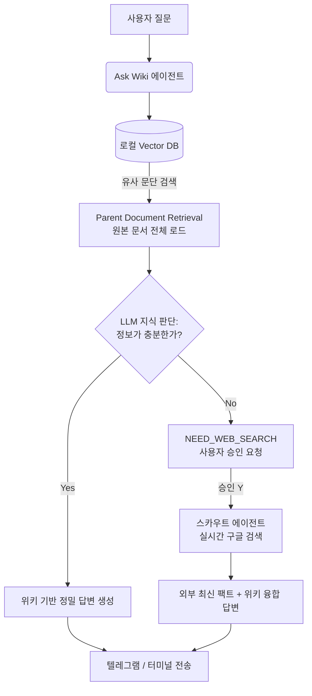

# 🎯 프롬프트 가이드라인 (제미나이 입력용)

> **[시스템 프롬프트]**
> 당신은 최고 수준의 전문 프레젠테이션(PPT) 기획자입니다.
> 아래 제공된 <프로젝트 정보>와 <슬라이드 구성안>을 바탕으로, 일반 사용자(IT 비전문가 포함)도 직관적으로 이해할 수 있는 매력적이고 세련된 발표용 슬라이드 10장 분량의 텍스트(마크다운 형식)를 완성해 주세요.
> 
> **[작성 지침]**
> 1. 각 슬라이드마다 **슬라이드 제목(Title), 본문 내용(Bullet points), 시각화 아이디어(Visuals), 발표자 대본(Speaker Notes)**을 구체적으로 작성할 것.
> 2. 너무 기술적인 용어(예: Vector DB, 청크, RAG)를 사용할 때는 괄호 안에 일반인이 이해할 수 있는 비유(예: 지식의 책갈피 찾기)를 곁들일 것.
> 3. 에이전트와 스킬들이 유기적으로 소통하며 "스스로 척척 알아서 일하는 시스템"이라는 점을 강조할 것.

---

# 🧠 프로젝트 정보: "하이브리드 지능형 LLM 위키 시스템"

## 1. 슬라이드 1: 타이틀 (인트로)
- **제목**: 당신만의 완벽한 지식 비서, 하이브리드 지능형 LLM 위키
- **내용**: 흩어진 지식을 하나로 모으고, 빛의 속도로 찾아주며, 잘못된 정보는 깔끔하게 지워주는 나만의 AI 지식베이스 시스템 소개.
- **시각화 아이디어**: 뇌(Brain)와 컴퓨터, 그리고 메신저(텔레그램)가 하나로 연결되어 반짝이는 세련된 다이아그램.

## 2. 슬라이드 2: 문제 제기 (Why we need this?)
- **제목**: 우리가 정보의 바다에서 겪는 3가지 고통
- **내용**:
  1. 정보의 파편화 (어디에 저장했더라?)
  2. 검색의 한계 (키워드가 정확히 기억나지 않으면 못 찾음)
  3. 지식의 오염 (잘못된 정보가 섞였을 때 빼내기가 불가능함)
- **시각화 아이디어**: 산더미처럼 쌓인 종이 서류와 노트북 앞에서 머리를 감싸 쥐고 있는 사람의 일러스트.

## 3. 슬라이드 3: 해결책 (The Solution)
- **제목**: 해답은 '지능형 메타-하네스 아키텍처'
- **내용**: 단순한 파일 저장소를 넘어, 여러 AI 에이전트(작업자)가 유기적으로 소통하며 스스로 지식을 분류하고 저장하는 시스템.
- **시각화 아이디어**: 여러 개의 로봇 팔(Agent)이 컨베이어 벨트를 따라 들어오는 문서들을 척척 분류하는 애니메이션 느낌의 아이콘.

## 4. 슬라이드 4: 전체 시스템 구성도 (Architecture)
- **제목**: 복잡한 기술을 가장 쉽게, 3-Tier 아키텍처
- **내용**:
  - **사용자(Telegram)**: 일상적인 메신저로 톡 하듯 명령.
  - **두뇌(Orchestrator)**: 사용자의 명령을 분석해 적절한 부서(에이전트)로 전달.
  - **기억장치(Vector DB & 마크다운)**: 초고속 검색용 창고와 영구 보존용 문서고의 하이브리드 결합.
- **시각화 아이디어**: 사용자 ↔ 중앙 오케스트레이터 ↔ 3개의 에이전트 ↔ DB로 이어지는 깔끔한 다이아그램.

## 5. 슬라이드 5: 첫 번째 기능 - 지식 컴파일 (Ingestion)
- **제목**: 지식을 먹어 치우고 소화하는 '컴파일러'
- **내용**:
  - 수백 페이지의 PDF나 보고서를 텔레그램으로 던지기만 하세요.
  - AI가 문맥을 파악하고 핵심 단위로 잘게 쪼개어(Chunking) 위키에 자연스럽게 흡수시킵니다.
  - "이 지식의 출처는 OOO 보고서"라는 꼬리표(메타데이터)를 자동으로 붙입니다.
- **시각화 아이디어**: 두꺼운 책이 파쇄기 같은 기계를 거쳐 예쁜 데이터 조각들로 포장되는 일러스트.

## 6. 슬라이드 6: 두 번째 기능 - 초고속 검색 (Retrieval/RAG)
- **제목**: 수만 장의 문서 중, 원하는 단 한 줄을 0.1초 만에
- **내용**:
  - 단순 키워드 검색이 아닙니다. 질문의 '의미'를 이해하는 검색(Vector Search).
  - 전체 문서를 다 읽지 않고, 관련된 책갈피 상위 5개만 핀셋처럼 뽑아냅니다.
  - 토큰 낭비 방지와 답변 속도의 혁신.
- **시각화 아이디어**: 거대한 도서관에서 로봇이 빛나는 책 한 권을 1초 만에 뽑아오는 모습.

## 7. 슬라이드 7: 세 번째 기능 - 무결점 롤백 (Safe Deletion)
- **제목**: 아차! 잘못된 정보를 넣었을 때의 '마법의 지우개'
- **내용**:
  - 일반적인 챗봇은 자기가 배운 잘못된 정보를 지우지 못합니다.
  - 우리는 꼬리표(출처) 추적 기술을 통해, 오염된 문서에서 파생된 모든 지식을 완벽하게 발라내어 삭제합니다.
  - `#삭제 잘못된문서.pdf` 명령어 하나면 끝!
- **시각화 아이디어**: 얽히고설킨 퍼즐 속에서 특정 빨간색 퍼즐 조각들만 쏙쏙 빠져나가는 다이아그램.

## 8. 슬라이드 8: 백그라운드의 숨은 일꾼들 (Agents & Skills)
- **제목**: 각자의 전문성을 가진 AI 요원들
- **내용**:
  - 오케스트레이터(총괄 매니저)
  - 로컬 모델(오프라인 보안 및 단순 분류) vs 클라우드 모델(복잡한 추론 및 보고서 작성)의 하이브리드 엔진 교체.
  - 텔레그램 데몬, 백그라운드 크론(Cron) 스케줄러 등.
- **시각화 아이디어**: 오케스트라 지휘자(메인 서버)와 각기 다른 악기를 연주하는 단원들(에이전트)의 메타포.

## 9. 슬라이드 9: 완벽한 지식 생태계의 완성 (Agentic Fallback)
- **제목**: 내장 지식의 한계를 뛰어넘는 '스카우트 에이전트'
- **내용**:
  - LLM 스스로 위키 지식의 부족함을 인지하고 판단(자기 객관화).
  - 정보 부족 시 `[NEED_WEB_SEARCH]` 구조 요청을 통해 실시간 외부 구글 검색(Scout Agent) 가동.
  - 보안성이 높은 **내부 지식(Parent Document Retrieval)**과 최신 **외부 팩트(Web Search)**의 완벽한 하이브리드 결합.
- **시각화 아이디어**: 내부 금고(위키)와 외부 안테나(웹 검색)를 자유롭게 오가며 정보를 수집하는 정찰 로봇(Scout) 다이아그램.

## 10. 슬라이드 10: 결론 및 질의응답
- **제목**: 당신만의 지식 생태계가 시작됩니다
- **내용**: 
  - 복잡한 IT 환경과 정보 홍수 속에서, 가장 빠르고 안전한 뇌(Brain)를 가지게 되었습니다.
  - Q&A.
- **시각화 아이디어**: 모든 톱니바퀴가 완벽하게 맞물려 돌아가며 사용자에게 보고서를 건네는 AI 비서의 모습.
