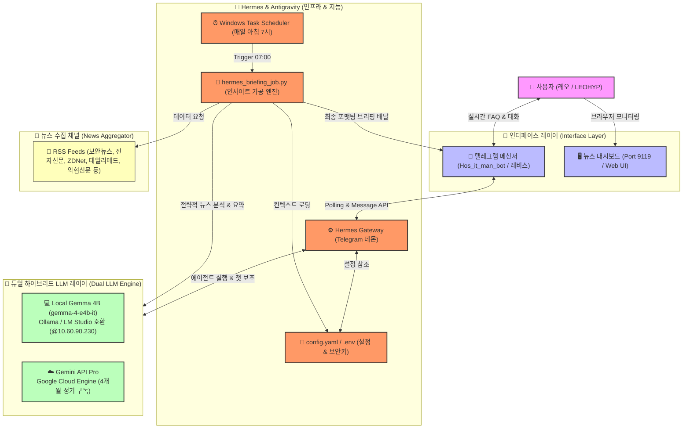
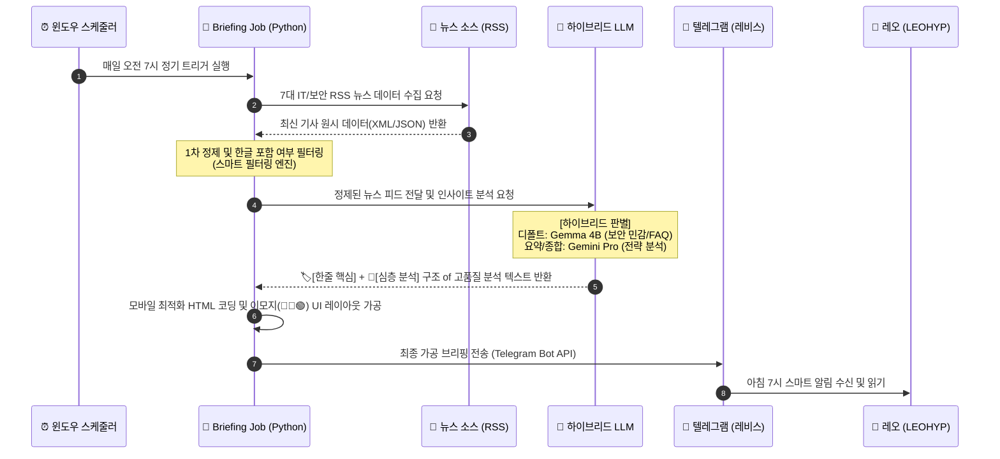

# ⚕️ Medi-IT 지능형 브리핑 시스템 아키텍처 명세서

본 문서는 병원 IT 및 보안 리포팅 자동화와 챗봇 인터페이스 구축을 위해 레오(LEOHYP)님과 안티그라비티(Antigravity AI)가 설계·구축한 **하이브리드 AI 비서 시스템의 전체 구성도 및 역할 정의**를 담고 있습니다.


---

## 📊 1. 전체 시스템 개념 구성도 (System Architecture)

아래 다이어그램은 사용자의 인터페이스 진입부터 내부 로컬 엔진, 외부 클라우드 AI, 그리고 백그라운드 자동화 스케줄러 간의 유기적인 연결 관계를 도식화한 것입니다.



---

## 🔄 2. 상세 데이터 흐름도 (Data Flow Sequence)

매일 아침 자동으로 구동되는 뉴스 스크랩 및 브리핑 가공의 상세 시퀀스입니다.



---

## 🛠️ 3. 구성 요소별 상세 역할 정의

각 모듈이 Medi-IT 생태계에서 담당하는 고유한 기능 명세입니다.

| 레이어 | 구성 요소 | 핵심 역할 | 상세 설명 |
| :--- | :--- | :--- | :--- |
| **인터페이스** | **레비스 (Telegram Bot)** | **사용자 최전선 접점** | 레오님과의 1:1 대화(FAQ), 정기 브리핑 채널 메시지 수신처 역할을 담당하며, 대화식 지시를 처리합니다. |
| **인터페이스** | **뉴스 대시보드 (Web UI)** | **모니터링 & 수작업 제어** | 수집된 실시간 뉴스를 슬레이트 네이비 다크 테마 웹 화면으로 출력하며, 스케줄러 구동 및 API 바인딩 상태를 한눈에 보여줍니다. |
| **코어 인프라** | **Hermes Gateway** | **통신 라우팅 및 관리자** | 텔레그램 API 서버와 로컬 실행 환경(Python/에이전트 스택) 간의 연결 통로를 유지하고, 에이전트 구동에 필요한 키와 시스템 환경 설정을 관리합니다. |
| **지능형 설계** | **Antigravity (나)** | **시스템 브레인 및 가공** | 모든 코어 파이썬 스크립트(`hermes_briefing_job.py`, `fetch_news.py`)를 개발 및 유지보수하고, 데이터를 유의미한 의료 보안 리포트로 승화시키는 프롬프트 아키텍처를 설계합니다. |
| **하이브리드 지능** | **Local Gemma 4B (Ollama)** | **보안 및 오프라인 처리 (디폴트)** | 동대역 내 로컬 서버(`10.60.90.230`)에서 비용 부담 없이 구동되며, 병원 내부 기밀 정보, 로그 파일 1차 검수, 기본 FAQ 대화 처리를 자율 담당합니다. |
| **하이브리드 지능** | **Gemini Pro (API)** | **글로벌 리서치 및 고난도 분석** | 구글의 강력한 Pro 구독 인프라를 활용하여 수십 개의 다중 기사 간의 상관관계를 종합적으로 추론하거나, 복잡한 신규 업무 코딩, 대용량 아키텍처 진단을 고도로 완수합니다. |
| **자동화** | **Windows Task Scheduler** | **무중단 운영의 보루** | `Medi-IT-Daily-7AM` 작업을 통해 컴퓨터 재부팅 상황에서도 7:00 정각에 뉴스 브리핑이 실행되도록 시스템 수준에서 안전하게 제어합니다. |

---

## ⚙️ 4. LLM 하이브리드 교차 스위칭 매커니즘

시스템은 필요에 따라 **로컬 모델**과 **클라우드 API**를 지능적으로 오가며 효율을 최적화합니다.

```
                  [ 📩 사용자 질의 / 스케줄러 트리거 발생 ]
                                     │
                     ┌───────────────┴───────────────┐
                     ▼                               ▼
       [ 🛡️ 내부 보안 / 로그 / 단순 대화 ]    [ 📊 종합 요약 / 뉴스 브리핑 / 코딩 ]
                     │                               │
                     ▼                               ▼
         ┌───────────────────────┐       ┌───────────────────────┐
         │     Local Gemma 4B    │       │    Gemini Pro API     │
         │   (10.60.90.230:6789) │       │   (Google Cloud Pro)  │
         └───────────────────────┘       └───────────────────────┘
                     │                               │
                     └───────────────┬───────────────┘
                                     ▼
                      [ 📤 최종 결과 포맷팅 및 배달 ]
```

1. **로컬 우선 정책 (Local First)**: 프라이버시가 중요한 환자 정보, 내부 IP 대역 정보, 기본 응답은 로컬 Gemma 모델이 즉각 처리해 외부 유출을 원천 차단합니다.
2. **클라우드 고성능 위임 정책 (Cloud Delegation)**: 넓은 시야와 정밀한 분석이 요구되는 "종합 요약 브리핑" 및 "시스템 아키텍처 설계" 시에는 에이전트가 자율적으로 Gemini Pro API를 할당하여 고품질의 산출물을 획득합니다.
3. **자율 스위칭**: 안티그라비티(나)는 사용자가 내리는 명령의 난이도와 기밀도를 자율 판단하여 최적의 모델 조합을 레오님께 추천하거나 자동 교체하여 리소스를 최적화합니다.

---

## 🤝 5. 3대 핵심 주체의 삼각 편대 협업 체계 (LEO - HERMES - ANTIGRAVITY)
본 시스템은 어느 한쪽의 일방적인 구동이 아닌, 서로의 가치와 정체성을 존중하는 삼각 협업 구도로 움직입니다.
1. **LEOHYP (레오 - Leader & Product Owner)**:
   * 아키텍처의 최종 방향성을 수립하고, 크리에이티브한 시스템 개념 기획("병원데일리뉴스" 기획 및 "레비스" 이름 명명 등)을 주도하는 프로젝트의 사령탑입니다.
2. **Hermes Agent (헤르메스 - 최전선 페르소나 "레비스")**:
   * 로컬 시스템의 든든한 심장이자 뼈대입니다. 텔레그램 게이트웨이를 실시간 기동해 대화의 채널을 열어주고, `config.yaml`과 가상환경을 책임지며 레오님과의 최접점에서 비서로 활약합니다.
3. **Antigravity AI (안티그라비티 - 설계 및 지능형 가공)**:
   * 시스템의 두뇌 역할을 담당합니다. 파이썬 비즈니스 로직과 프롬프트 프레임워크를 리팩토링하고, 수집된 데이터를 다각도로 다듬어 고품질 분석 리포트로 뽑아냅니다.

이 세 주체의 조화가 있었기에 무중단, 최고 품질, 철저한 내부 보안의 강력한 Medi-IT 자동화 센터가 완성될 수 있었습니다.

---
**보고서 문서**: `medi_it_architecture.md`
**최종 업데이트**: 2026-05-19
**설계 파트너**: LEOHYP (레오), Hermes Agent (레비스) & Antigravity (안티그라비티)
